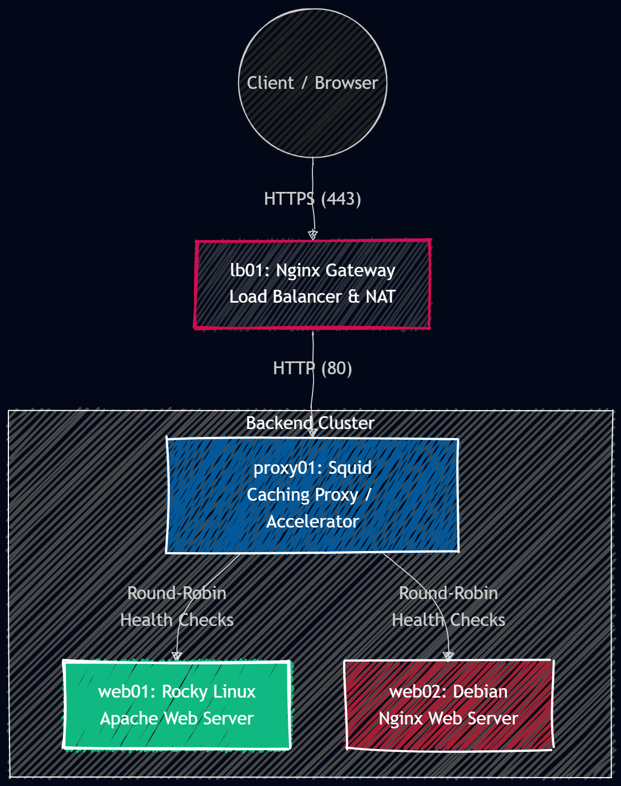

# 🚀 Enterprise-Grade High Availability Web Cluster \& Caching Architecture


## 📌 Project Overview

This project demonstrates the design and implementation of a highly available (HA), fault-tolerant distributed web infrastructure. Built to **LPIC-2 standards**, it showcases advanced Linux system administration skills, including kernel-level routing (NAT), reverse proxying, dynamic caching strategies, and secure communications (SSL/TLS).

## 🏗️ Architecture & Traffic Flow

The network is strictly isolated. Backend servers do not have direct internet access and route their outgoing traffic through the Gateway node via NAT/Masquerading.



## 🖥️ Infrastructure Nodes

|Hostname|Role|OS|IP Address|Key Services|
|-|-|-|-|-|
|`lb01`|Gateway \& LB|Ubuntu 24.4|`10.1.1.2`|Nginx, iptables (NAT)|
|`proxy01`|Cache Proxy|Ubuntu 24.4|`10.1.1.3`|Squid Proxy|
|`web01`|Backend 1|Rocky Linux 10.2|`10.1.1.10`|Apache (httpd)|
|`web02`|Backend 2|Debian 13.5.0|`10.1.1.11`|Nginx|

## 📂 Repository Structure

All configuration files are cleanly organized in the `configs/` directory.

```text
scalable-web-cluster/
├── README.md
└── configs/
    ├── nginx-gateway/
    │   └── loadbalancer.conf
    ├── squid-proxy/
    │   └── squid.conf
    └── web-servers/
        ├── web01-rocky-index.html
        └── web02-debian-index.html
```

## Testing High Availability (Disaster Recovery)

1. Navigate to `https://<LB_NAT_IP>`. Traffic balances between Web01 and Web02.
2. SSH into `web01` and stop the service: `sudo systemctl stop httpd`
3. Refresh the browser. **Zero downtime** is experienced. Squid detects the failure (`connect-fail-limit=2`) and routes 100% of traffic to `web01`.

